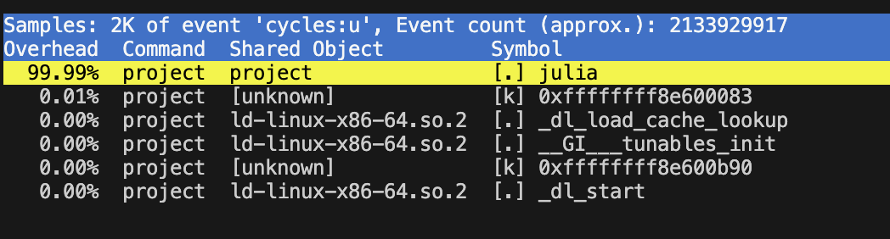
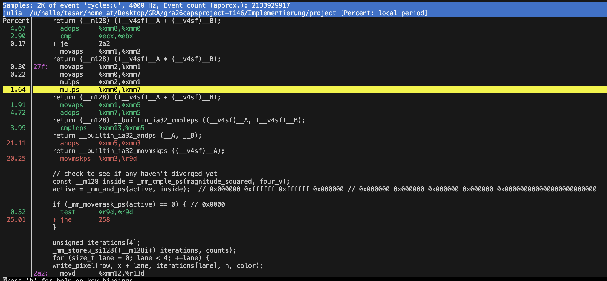
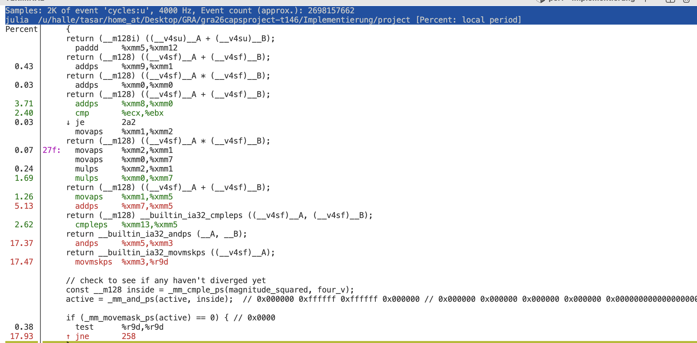

# Profiling

## Setup

- Implementation: V0 SIMD
- Build: `-O3 -g -msse4.2`
- Image: 800 x 600 pixels
- Maximum iterations: 100
- Benchmark repetitions: 100
- Event: user-space CPU cycles (`cycles:u`)
- Machine: AMD EPYC 9554P on `halle.cli.ito.cit.tum.de`

The grayscale and color runs used the same Julia-set parameters. The color run only adds `-C`.

## First profiling findings

### Grayscale

`perf report` attributes 99.99% of the samples to `julia`. This confirms that the Julia calculation is the part worth optimizing.

The largest group of samples in `perf annotate` is around the active-lane check:

| Instruction | Samples |
|---|---:|
| `andps` | 21.11% |
| `movmskps` | 20.25% |
| `jne` | 25.01% |
| Combined region | 66.37% |

The counter run measured 2.55 instructions per cycle, a 0.32% branch-miss rate, and 22,083 cache misses. The low branch-miss rate suggests that branch prediction is not the main problem.

### Color

The color run has the same hot region, but its share is lower:

| Instruction | Samples |
|---|---:|
| `andps` | 17.37% |
| `movmskps` | 17.47% |
| `jne` | 17.93% |
| Combined region | 52.77% |

The mask check is still the largest visible hotspot. Its smaller share is probably caused by the extra RGB calculations in `write_pixel`, but the current screenshot does not show those instructions directly.

### Likely cause

Every SIMD iteration performs this dependent sequence:

1. Compare the four magnitudes with the escape limit.
2. Update the active-lane mask.
3. Move the mask from the SIMD register to an integer register.
4. Branch depending on whether any lane is still active.

Each step needs the result of the previous step. The processor therefore has fewer independent instructions available while it waits. The percentages belong to this whole region; sampling can place a sample a few instructions after the actual stall.

### Possible optimizations

#### A. Interleaving two four-pixel blocks

A possible next step is to process two independent four-pixel blocks and interleave their iteration steps. While one block waits for a dependent result, the processor may execute instructions from the other block.

This is only a hypothesis. The change may also increase register pressure.

#### B. Strided active-lane check

The `andps`/`movmskps`/`jne` region holds 66.37% of the grayscale samples and 52.77% of the color samples. The check has two parts:

- The mask and count update (`active &= inside` and the count increment) is required every iteration for correct per-lane counts.
- The early exit (`movmskps` and the branch) only decides when the whole block can stop. It does not change the counts.

A possible change is to keep the mask and count update on every iteration, but evaluate the early exit only every `K` iterations. This shortens the repeated `cmple -> andps -> movmskps -> jne` dependency chain. In particular, `movmskps` moves the mask from the SIMD domain to an integer register on the critical path. This explanation is consistent with the measured 2.55 IPC and the low 0.32% branch-miss rate: the dependency chain looks more relevant than branch misprediction.

The output should remain unchanged because the active mask has been monotonic since commit `3a6f4b8`. Once a lane becomes inactive, later iterations add zero to its count. Delaying the early exit therefore performs extra masked iterations without changing the final per-lane counts, so V0 should remain byte-identical to V1.

The trade-off is up to `K - 1` wasted iterations after every lane in a block has escaped. `K` would need to be tested empirically. It will be exposed as a new command-line option so the values can be compared with the benchmark script.

#### C. Masked count using subtraction

The current count update, `counts += (active & 1)`, needs an AND, an ADD, and a register holding the vector of ones. An active lane contains all one bits, which is `-1` as a signed 32-bit integer. The same update can therefore be written as `counts - active`: subtracting `-1` increments an active lane, while subtracting zero leaves an inactive lane unchanged.

This could remove one vector operation and free one register. The free register may also reduce the register pressure introduced by candidate A. The direct speedup is expected to be small and may not be measurable; the main reason to keep this candidate is its possible effect on register pressure.

#### Validation order

1. Run the V0/V1 correctness gate and require byte-identical output.
2. Compare the result with the baseline using `benchmark.sh`.
3. Re-profile the changed code with the precise `cycles:upp` event.

## Evidence limits

The screenshots are enough to show the first hotspot and compare its relative share in grayscale and color. The raw `perf.data` files are kept so the runs can be opened again.

They are not enough to claim a precise . The machine had 223 logged-in users and a load average around 41 during the precondition check. The grayscale counter data also comes from one run, without repeated-run variation. Final before/after performance numbers should come from the benchmark script on the same machine under speedupquieter conditions.
